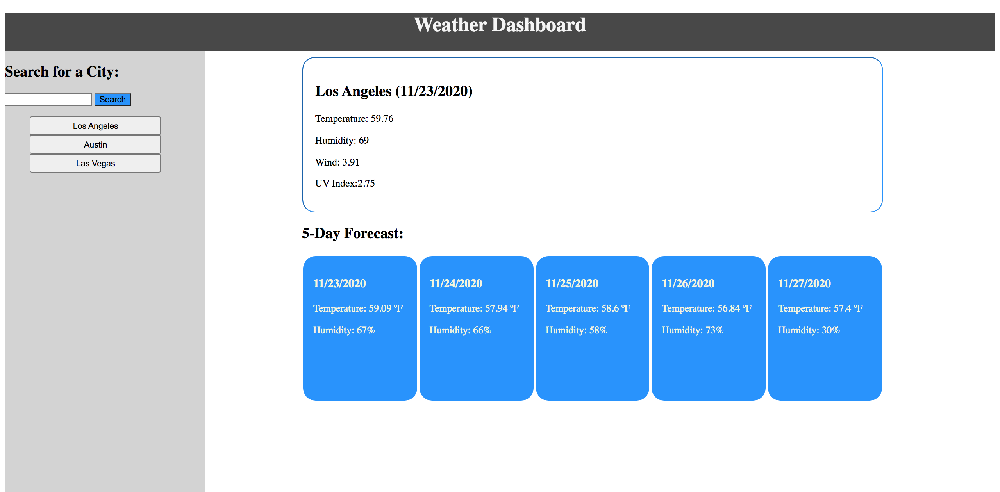

# weather-app

## Introduction
An interactive weather app that populates the current weather and the five day forecast for a given city. 

## How to Use
1. Input a city name in the input box OR click a city button.
2. Dress appropriately!

## Design
* html templates populate with ajax queries to open weather API
* dayJS date library for date formatting

## Files and Directory
* weather-app
    * screenshots
        * screen1.png
    * index.html
    * script.js        
    * style.css
    * README.md

## Link
[Link to Live Website](https://jesusefraingonzalez.github.io/weather-app)

## ScreenShots

